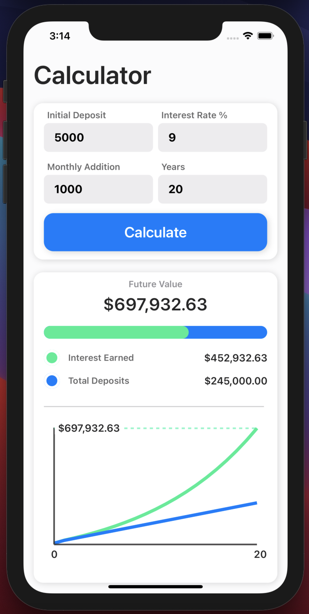

# Investment Calculator - built using Xcode

A simple, modern compound interest calculator, which takes a number of inputs including an annual interest rate to calculate the potential value of your investments in the future. 

Then utilises swiftUI charts to animate and display the correlation between the growth of your investment against your deposits. 

